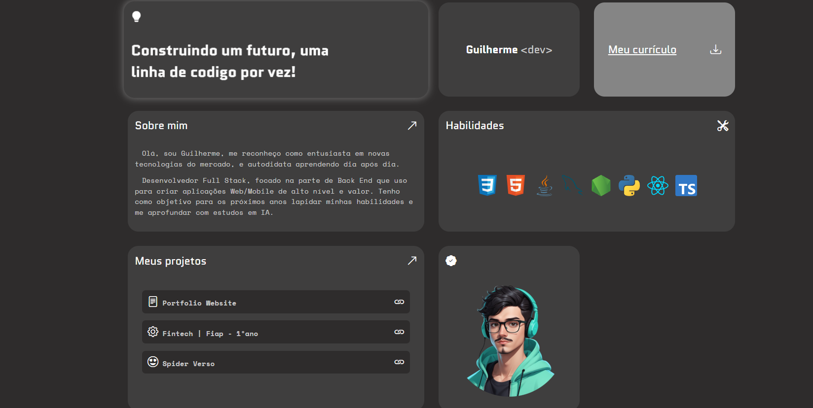

 

# portfolio_guicarbar-v1

> Este projeto representa minha visão de um site que serve como portfólio dos meus principais projetos e uma forma de apresentar quem eu sou.

> A ideia principal foi criar um site utilizando apenas HTML, CSS e JavaScript, sem o auxílio de frameworks ou ferramentas adicionais. 🛠️ Isso permite que o site reflita diretamente meu aprendizado e habilidades no desenvolvimento web.

> Meu objetivo é evoluir este portfólio continuamente, incorporando novas tecnologias e ideias à medida que adquiro mais conhecimento na área.

[Visite o projeto](https://guicarbar.github.io/portfolio_guicarbar-v1/)

## Tecnologias

  
  
  

## Contribuir

1. **Clonar projeto:**: `git clone git clone https://github.com/guicarbar/portfolio_guicarbar-v1.git`
2. **Criar feature/branch:**: `git checkout -b feature/Nome-da-branch`

## Licença

Este projeto está sob a licença [MIT](LICENSE) License.